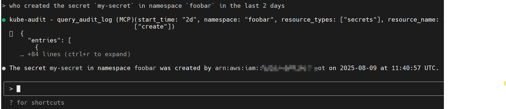

# kube-audit-mcp

kube-audit-mcp is a Model Context Protocol (MCP) server that gives AI agents, assistants,
and chatbots the ability to query Kubernetes Audit Logs.



## Table of Contents

* [Installation](#installation)
* [MCP Clients](#mcp-clients)
    * [Claude Code](#claude-code)
    * [Claude Desktop](#claude-desktop)
    * [Gemini CLI](#gemini-cli)
    * [VS Code](#vs-code)
* [Transport Options](#transport-options)
    * [STDIO Transport (Default)](#stdio-transport-default)
* [Configurations](#configurations)
    * [Sample Config](#sample-config)
    * [Provider Config](#provider-config)
        * [Alibaba Cloud Log Service](#alibaba-cloud-log-service)
        * [AWS CloudWatch Logs](#aws-cloudwatch-logs)


## Installation

1. First, download and install the latest release from the [releases page](https://github.com/mozillazg/kube-audit-mcp/releases).
2. Then, configure the provider of Kubernetes Audit Logs. See [Configurations](#configurations) for details.


## MCP Clients

Theoretically, any MCP client should work with kube-audit-mcp. 

**Standard config** works in most of the clients:

```json
{
  "mcpServers": {
    "kube-audit": {
      "type": "stdio",
      "command": "kube-audit-mcp",
      "args": [
        "mcp"
      ]
    }
  }
}
```

### Claude Code

<details>

Use the Claude Code CLI to add the kube-audit-mcp:

```
claude mcp add kube-audit kube-audit-mcp mcp
```

</details>

### Claude Desktop
<details>

Follow the MCP install [guide](https://modelcontextprotocol.io/quickstart/user), use the standard config above.

</details>

### Gemini CLI

<details>

Follow the MCP install [guide](https://github.com/google-gemini/gemini-cli/blob/main/docs/tools/mcp-server.md#configure-the-mcp-server-in-settingsjson), 
use the standard config above.

</details>


### VS Code

<details>

Follow the MCP install [guide](https://code.visualstudio.com/docs/copilot/chat/mcp-servers#_add-an-mcp-server), 
use the standard config above. You can also install the kube-audit-mcp MCP server using the VS Code CLI:

```bash
# For VS Code
code --add-mcp '{"name":"kube-audit","command":"kube-audit-mcp","args":["mcp"]}'
```

After installation, the kube-audit-mcp MCP server will be available for use with your GitHub Copilot agent in VS Code.

</details>


## Transport Options

### STDIO Transport (Default)

The default transport mode uses standard input/output for communication.
This is the standard MCP transport used by most clients like Claude Desktop.

```
# Run with default stdio transport
kube-audit-mcp mcp

# Or explicitly specify stdio
kube-audit-mcp mcp --transport stdio
```


## Configurations

kube-audit-mcp requires a configuration file to specify the provider of Kubernetes Audit Logs.
The configuration file is typically located at `~/.config/kube-audit-mcp/config.yaml`
or specified via the `--config` flag.


### Sample Config

You can get a sample config via the following command:

```
kube-audit-mcp sample-config
```

<details>

<summary>Here is a sample configuration file</summary>

```yaml
default_cluster: prod              # The default cluster to use
clusters:                          # List of clusters
  - name: prod                     # Name of the cluster
    provider:
      name: aws-cloudwatch-logs    # Use CloudWatch Logs as the provider
      aws_cloudwatch_logs:
        log_group_name: /aws/eks/test/cluster  # Replace with your CloudWatch Logs log group name
  - name: dev                     # Name of the cluster
    provider:
      name: alibaba-sls            # Use Alibaba Cloud Log Service as the provider
      alibaba_sls:
        endpoint: cn-hangzhou.log.aliyuncs.com  # Replace with your Log Service endpoint
        project: k8s-log-cxxx                   # Replace with your Log Service project
        logstore: audit-cxxx                    # Replace with your Log Service logstore
```

</details>


Or save the sample configuration to the default config file location:

```
kube-audit-mcp sample-config --save
```

### Provider Config

#### Alibaba Cloud Log Service

Prerequisites:
* [Install and configure the Alibaba Cloud CLI with credentials](https://www.alibabacloud.com/help/en/cli/configure-credentials)
* Ensure your Alibaba Cloud user or role has the necessary permissions to read from the specified Log Service project and logstore.
  The following policy can be used to grant the necessary permissions:

<details>

<summary>RAM permissions</summary>

```json
{
  "Version": "1",
  "Statement": [
    {
      "Effect": "Allow",
      "Action": [
        "log:GetLogStoreLogs"
      ],
      "Resource": "*"
    }
  ]
}
```

</details>


Config:

```yaml
name: alibaba-sls
alibaba_sls:
  endpoint: cn-hangzhou.log.aliyuncs.com  # Replace with your Log Service endpoint
  logstore: ${log_store}                  # Replace with your Log Service logstore
  project: ${project_name}                # Replace with your Log Service project
```

#### AWS CloudWatch Logs

Prerequisites:

* [Install and configure the AWS CLI with credentials](https://docs.aws.amazon.com/cli/latest/userguide/cli-chap-configure.html)
* Ensure your AWS IAM user or role has the necessary permissions to read from the specified CloudWatch Logs log group.
  The following policy can be used to grant the necessary permissions:

<details>

<summary>IAM permissions</summary>

```json
{
  "Version": "2012-10-17",
  "Statement": [
    {
      "Effect": "Allow",
      "Action": [
        "logs:StartQuery",
        "logs:GetQueryResults"
      ],
      "Resource": "*"
    }
  ]
}
```

</details>


Config:

```yaml
name: aws-cloudwatch-logs
aws_cloudwatch_logs:
  log_group_name: /aws/eks/${cluster_name}/cluster # Replace with your CloudWatch Logs log group name
```
