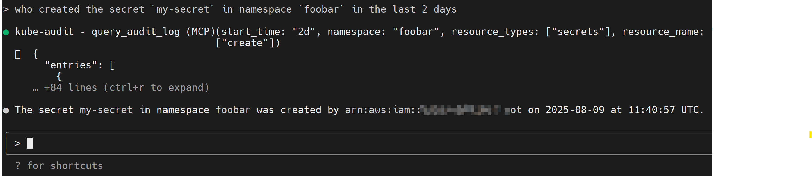

# kube-audit-mcp

kube-audit-mcp 是一个模型上下文协议 (MCP) 服务器，它使 AI Agent、助理和聊天机器人能够查询 Kubernetes 审计日志。



## 目录

* [安装](#安装)
* [MCP 客户端](#mcp-客户端)
    * [Claude Code](#claude-code)
    * [Claude Desktop](#claude-desktop)
    * [Gemini CLI](#gemini-cli)
    * [VS Code](#vs-code)
* [传输选项](#传输选项)
    * [STDIO 传输 (默认)](#stdio-传输-默认)
* [配置](#配置)
    * [示例配置](#示例配置)
    * [提供商](#提供商)
        * [阿里云日志服务](#阿里云日志服务)
        * [AWS CloudWatch Logs](#aws-cloudwatch-logs)


## 安装

1. 首先，从 [发布页面](https://github.com/mozillazg/kube-audit-mcp/releases) 下载并安装最新版本。
2. 然后，配置 Kubernetes 审计日志的提供商。有关详细信息，请参阅[配置](#配置)。


## MCP 客户端

理论上，任何 MCP 客户端都应该可以与 kube-audit-mcp 一起使用。

**标准配置**适用于大多数客户端：

```json
{
  "mcpServers": {
    "kube-audit": {
      "type": "stdio",
      "command": "kube-audit-mcp",
      "args": [
        "mcp"
      ]
    }
  }
}
```

### Claude Code

<details>

使用 Claude Code CLI 添加 kube-audit-mcp：

```
claude mcp add kube-audit kube-audit-mcp mcp
```

</details>

### Claude Desktop
<details>

按照 MCP 安装[指南](https://modelcontextprotocol.io/quickstart/user)，使用上面的标准配置。

</details>

### Gemini CLI

<details>

按照 MCP 安装[指南](https://github.com/google-gemini/gemini-cli/blob/main/docs/tools/mcp-server.md#configure-the-mcp-server-in-settingsjson)，
使用上面的标准配置。

</details>


### VS Code

<details>

按照 MCP 安装[指南](https://code.visualstudio.com/docs/copilot/chat/mcp-servers#_add-an-mcp-server)，
使用上面的标准配置。您还可以使用 VS Code CLI 安装 kube-audit-mcp MCP 服务器：

```bash
# For VS Code
code --add-mcp '{"name":"kube-audit","command":"kube-audit-mcp","args":["mcp"]}'
```

安装后，kube-audit-mcp MCP 服务器将可用于您在 VS Code 中的 GitHub Copilot 代理。

</details>


## 传输选项

### STDIO 传输 (默认)

默认传输模式使用标准输入/输出进行通信。
这是大多数客户端（如 Claude Desktop）使用的标准 MCP 传输。

```
# 使用默认 stdio 传输运行
kube-audit-mcp mcp

# 或显式指定 stdio
kube-audit-mcp mcp --transport stdio
```


## 配置

kube-audit-mcp 需要一个配置文件来指定 Kubernetes 审计日志的提供商。
配置文件通常位于 `~/.config/kube-audit-mcp/config.yaml`
或通过 `--config` 标志指定。


### 示例配置

您可以通过以下命令获取示例配置：

```
kube-audit-mcp sample-config
```

<details>

<summary>这是一个示例配置文件</summary>

```yaml
default_cluster: prod              # 要使用的默认集群
clusters:                          # 集群列表
  - name: prod                     # 集群名称
    provider:                      # 提供商配置，详见下文
      name: aws-cloudwatch-logs    # 使用 CloudWatch Logs 作为提供商
      aws_cloudwatch_logs:
        log_group_name: /aws/eks/test/cluster  # 替换为您的 CloudWatch Logs 日志组名称
  - name: dev                     # 集群名称
    provider:
      name: alibaba-sls            # 使用阿里云日志服务作为提供商
      alibaba_sls:
        endpoint: cn-hangzhou.log.aliyuncs.com  # 替换为您的日志服务 endpoint
        project: k8s-log-cxxx                   # 替换为您的日志服务 project
        logstore: audit-cxxx                    # 替换为您的日志服务日志库
```

</details>


或者将示例配置保存到默认配置文件位置：

```
kube-audit-mcp sample-config --save
```

### 提供商

#### 阿里云日志服务

先决条件：
* [安装和配置具有凭据的阿里云 CLI](https://www.alibabacloud.com/help/en/cli/configure-credentials)
* 确保您的阿里云用户或角色具有从指定的日志服务项目和日志库读取日志的必要权限。
  以下策略可用于授予必要的权限：

<details>

<summary>RAM 权限</summary>

```json
{
  "Version": "1",
  "Statement": [
    {
      "Effect": "Allow",
      "Action": [
        "log:GetLogStoreLogs"
      ],
      "Resource": "*"
    }
  ]
}
```

</details>


配置：

```yaml
name: alibaba-sls
alibaba_sls:
  endpoint: cn-hangzhou.log.aliyuncs.com  # 替换为您的日志服务终端节点
  logstore: ${log_store}                  # 替换为您的日志服务日志库
  project: ${project_name}                # 替换为您的日志服务项目
```

#### AWS CloudWatch Logs

先决条件：

* [安装和配置具有凭据的 AWS CLI](https://docs.aws.amazon.com/cli/latest/userguide/cli-chap-configure.html)
* 确保您的 AWS IAM 用户或角色具有从指定的 CloudWatch Logs 日志组读取日志的必要权限。
  以下策略可用于授予必要的权限：

<details>

<summary>IAM 权限</summary>

```json
{
  "Version": "2012-10-17",
  "Statement": [
    {
      "Effect": "Allow",
      "Action": [
        "logs:StartQuery",
        "logs:GetQueryResults"
      ],
      "Resource": "*"
    }
  ]
}
```

</details>


配置：

```yaml
name: aws-cloudwatch-logs
aws_cloudwatch_logs:
  log_group_name: /aws/eks/${cluster_name}/cluster # 替换为您的 CloudWatch Logs 日志组名称
```
